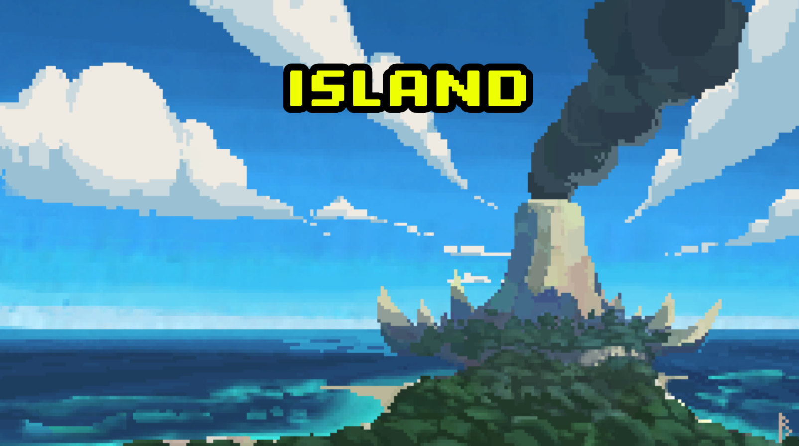
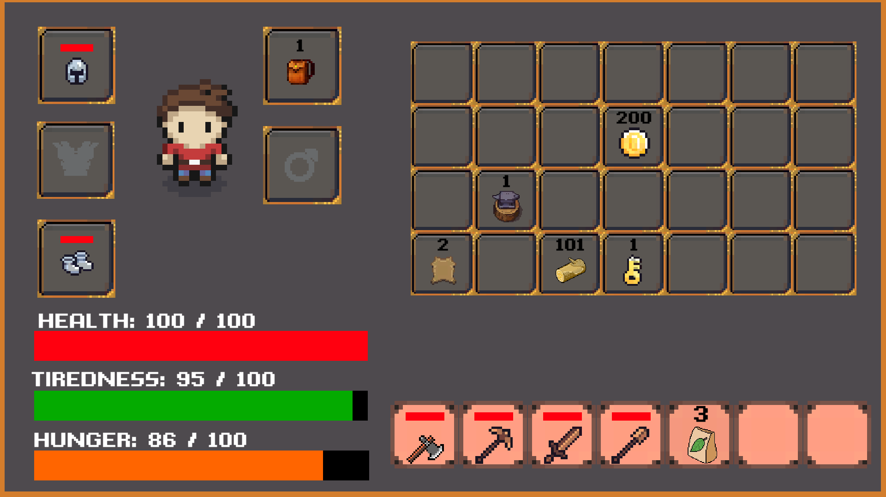
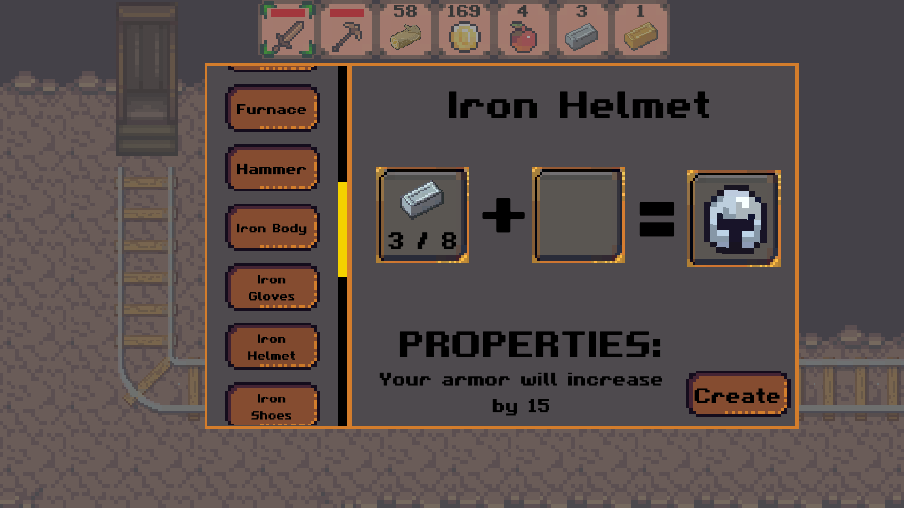
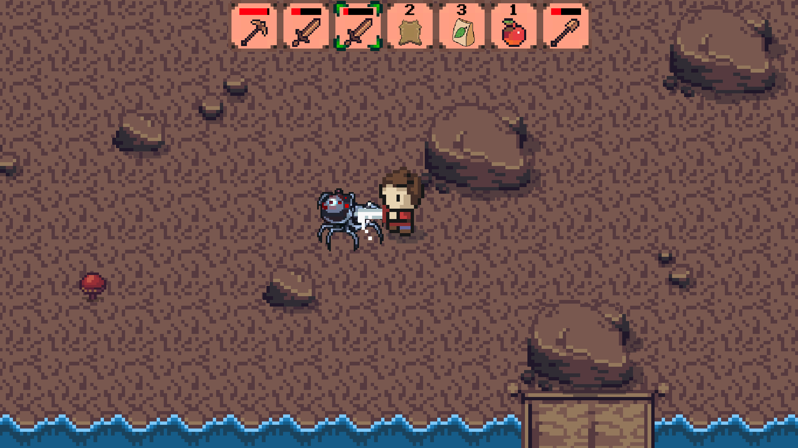
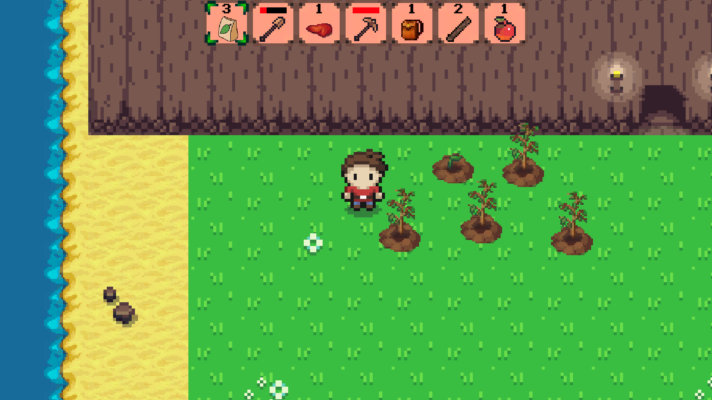
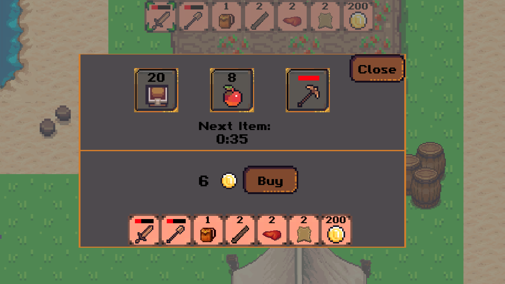
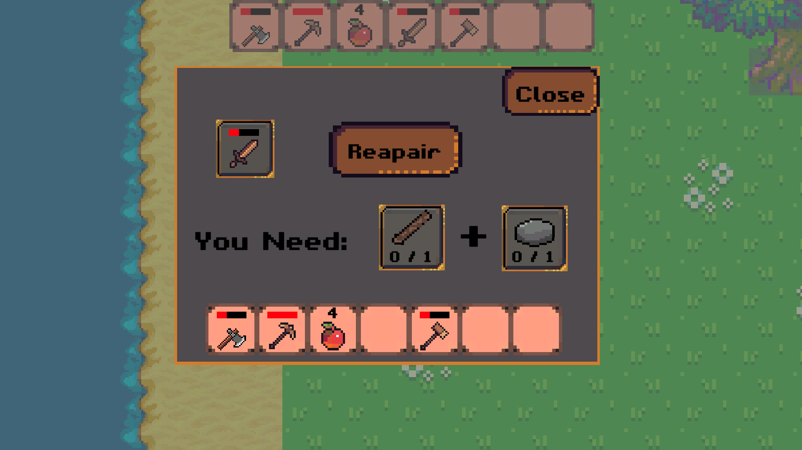
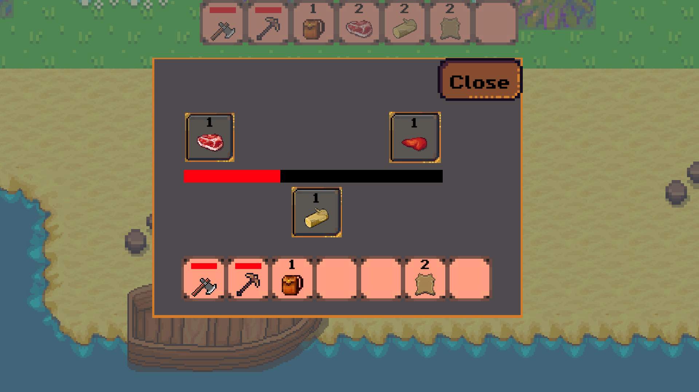

Island is an exciting survival game. Stranded on a remote island, you must gather resources, and construct a thriving base while venturing out to explore neighboring islands for valuable treasures and new discoveries.

<b>Itch:<b> https://libertox.itch.io/island/  
  
# Main Features

## Inventory System
A key feature in survival games is the ability to manage and organize your resources and items. Players have an inventory where they can store and carry various items they gather or craft throughout the game.
  

  
## Crafting System
Crafting is a core aspect of survival games. Players gather resources from the environment and use them to create new items, tools, weapons, or equipment. 
  

  
## Combat System
Game include simple combat mechanics to defend against hostile creatures.
  

  
## Plant System
Game incorporate a plant system, allowing players to grow plants. This can provide a renewable source of food, materials.
  

  
## Shop System
Shop allows players trade or purchase items, equipment, or resources from merchant.
  

  
 ## Repair Item
 Players can repair their equipment when it is close to destroy
  
 
  
 ## Cooking System
 Players can gather and cook food to replenish hunger.
  
 
  
